# Ecosystem Concept Map

> **Mermaid source for the ecosystem domain concept map.** Reproducible per CR-WSF-17 Rev.1 §14.

## Source

```mermaid
graph TD
    subgraph "Tier 1 (Existing WSF Primitives)"
        SYS["wsf:System"]
        ENT["wsf:Entity"]
        ACT["wsf:Actor"]
        REL["wsf:Relationship"]
        STA["wsf:State"]
        EVT["wsf:Event"]
        DISP["wsf:Disposition"]
        PROP["wsf:Proposition"]
        RULE["wsf:Rule"]
        MES["wsf:Measure"]
    end

    subgraph "Tier 3: Worked Example"
        ECO["wsf:Ecosystem<br/>(WORKED EXAMPLE)"]
    end

    subgraph "Tier 3: Top-Level Specialisations"
        BE["wsf:Business Ecosystem"]
        DBE["wsf:Digital Business Ecosystem"]
    end

    subgraph "Tier 3: Actors"
        ORCH["wsf:Orchestrator<br/>(Keystone)"]
        COMP["wsf:Complementor<br/>(Niche Player)"]
        DOM["wsf:Dominator<br/>(degraded)"]
        GATE["wsf:Gatekeeper"]
        PROS["wsf:Prosumer"]
        BS["wsf:Boundary Spanner"]
    end

    subgraph "Tier 3: Structure"
        PLAT["wsf:Platform"]
        MKT["wsf:Marketplace"]
        BR["wsf:Boundary Resources"]
        MOD["wsf:Modularity"]
        IOS["wsf:Interoperability Standards"]
        CPL["wsf:Coupling Level"]
    end

    subgraph "Tier 3: Value Dynamics"
        NE["wsf:Network Effect"]
        DNE["wsf:Direct NE"]
        INE["wsf:Indirect NE"]
        VCC["wsf:Value Co-creation"]
        VEX["wsf:Value Exchange"]
        VS["wsf:Value Slippage"]
        SWC["wsf:Switching Costs"]
        LOCK["wsf:Lock-In"]
    end

    subgraph "Tier 3: Governance"
        GOV["wsf:Governance"]
        DRA["wsf:Decision Rights Allocation"]
        COOP["wsf:Coopetition"]
        IA["wsf:Incentive Alignment"]
        TM["wsf:Trust Mechanisms"]
    end

    subgraph "Tier 3: Lifecycle"
        LC_B["wsf:Birth"]
        LC_E["wsf:Expansion"]
        LC_L["wsf:Leadership"]
        LC_R["wsf:Self-Renewal or Death"]
    end

    subgraph "Tier 3: Health"
        HEAL["wsf:Ecosystem Health"]
        PROD["wsf:Productivity"]
        ROB["wsf:Robustness"]
        NC["wsf:Niche Creation"]
    end

    %% Tier 1 → Tier 3 specialisations
    SYS --> ECO
    ECO --> BE
    BE --> DBE

    %% Actors
    ACT --> ORCH
    ACT --> COMP
    ACT --> GATE
    ACT --> PROS
    ACT --> BS
    ORCH --> DOM

    %% Structure
    ENT --> PLAT
    PLAT --> MKT
    ENT --> BR
    DISP --> MOD
    RULE --> IOS
    REL --> CPL

    %% Value dynamics
    DISP --> NE
    NE --> DNE
    NE --> INE
    PROP --> VCC
    REL --> VEX
    EVT --> VS
    DISP --> SWC
    STA --> LOCK

    %% Governance
    PROP --> GOV
    REL --> DRA
    STA --> COOP
    DISP --> IA
    SYS --> TM

    %% Lifecycle
    STA --> LC_B
    STA --> LC_E
    STA --> LC_L
    STA --> LC_R

    %% Health
    DISP --> HEAL
    MES --> PROD
    MES --> ROB
    MES --> NC

    %% Cross-cluster emergent relationships
    ECO -.->|emergent| NE
    ECO -.->|emergent| LOCK
    ECO -.->|emergent| HEAL
    ECO -.->|state| LC_E

    %% Coopetition & Lock-In composition
    COOP -.->|composes with| GOV
    NE -.->|produces| LOCK
    SWC -.->|contributes to| LOCK

    %% Health decomposition
    HEAL -->|measured_by| PROD
    HEAL -->|measured_by| ROB
    HEAL -->|measured_by| NC
```

## Style note

This is the high-level concept map. Domain relationships (the 15 `wsf-rel-eco:*` predicates) are documented separately in `concepts/relationships/ecosystem-relational-properties.md` to keep this map readable.
