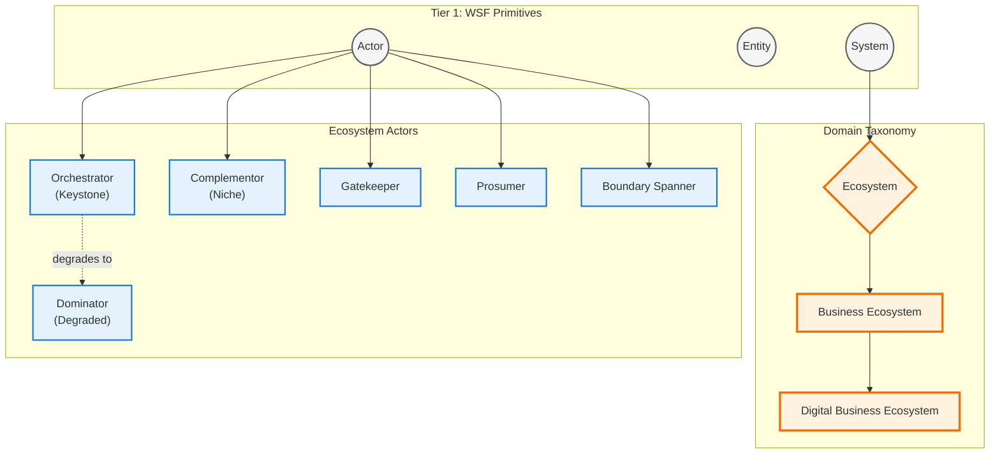
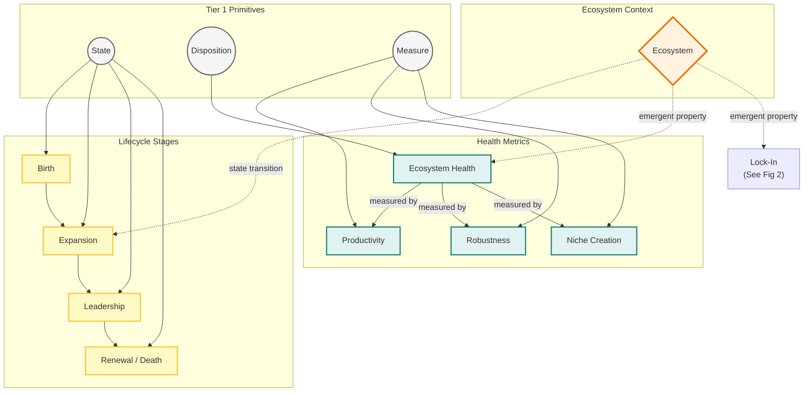
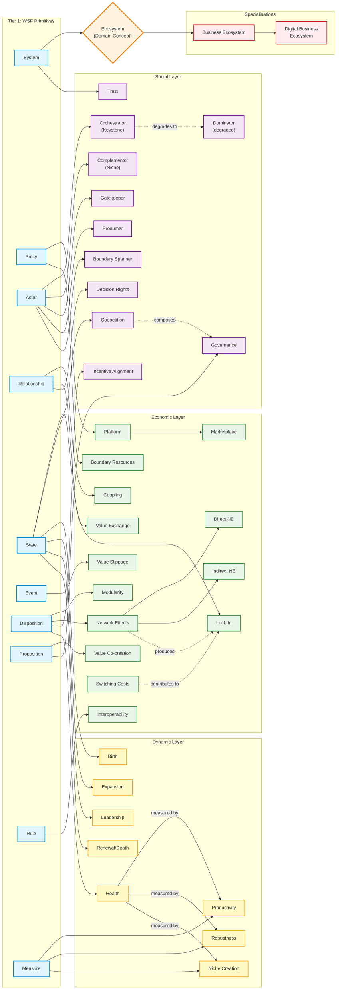

# Ecosystem Concept Maps

Core Taxonomy & Actors (The "Who" and "What")

These are hree focused, thematic diagrams. This approach drastically reduces cognitive load by chunking the ontology into logical layers: Taxonomy & Actors, Structure & Value, and Lifecycle & Health.
 
## Source
> **This diagram establishes the foundational hierarchy and the entities that populate the ecosystem.**


## Diagram 2: Structure, Governance & Value (The "How" and "Where")
This diagram maps the mechanics of the platform, how it is governed, and how value is created and captured.

```mermaid
graph LR
    subgraph T1["Tier 1 Primitives"]
        ENT(("Entity"))
        REL(("Relationship"))
        DISP(("Disposition"))
        PROP(("Proposition"))
        RULE(("Rule"))
        STA(("State"))
        EVT(("Event"))
    end

    subgraph Struct["Structure & Platform"]
        PLAT["Platform"]
        MKT["Marketplace"]
        BR["Boundary Resources"]
        MOD["Modularity"]
        IOS["Interoperability"]
        CPL["Coupling Level"]
    end

    subgraph Gov["Governance"]
        GOV["Governance"]
        DRA["Decision Rights"]
        COOP["Coopetition"]
        IA["Incentive Alignment"]
        TM["Trust"]
    end

    subgraph Val["Value Dynamics"]
        NE["Network Effects"]
        DNE["Direct NE"]
        INE["Indirect NE"]
        VCC["Value Co-creation"]
        VEX["Value Exchange"]
        VS["Value Slippage"]
        SWC["Switching Costs"]
        LOCK["Lock-In"]
    end

    %% Tier 1 Mappings
    ENT --> PLAT & BR
    DISP --> MOD & IA & SWC
    RULE --> IOS
    REL --> CPL & VEX & DRA
    PROP --> VCC & GOV
    STA --> COOP
    EVT --> VS

    %% Internal Flows
    PLAT --> MKT
    NE --> DNE & INE
    HEAL["Health"] ~~~| |Val %% Invisible link for alignment if needed
    
    %% Emergent/Compositional
    NE -.->|produces| LOCK
    SWC -.->|contributes to| LOCK
    COOP -.->|composes| GOV

    %% Styling
    classDef tier1 fill:#f5f5f5,stroke:#616161,stroke-width:2px,color:#333
    classDef struct fill:#e8f5e9,stroke:#388e3c,stroke-width:2px,color:#333
    classDef gov fill:#f3e5f5,stroke:#7b1fa2,stroke-width:2px,color:#333
    classDef val fill:#ffebee,stroke:#d32f2f,stroke-width:2px,color:#333

    class ENT,REL,DISP,PROP,RULE,STA,EVT tier1
    class PLAT,MKT,BR,MOD,IOS,CPL struct
    class GOV,DRA,COOP,IA,TM gov
    class NE,DNE,INE,VCC,VEX,VS,SWC,LOCK val
```

## Diagram 3: Lifecycle & Health (The "When" and "How Well")
This diagram focuses on temporal evolution and the metrics used to evaluate the system's viability.



> **Complete ecosystem domain concept map.** Reproducible per CR-WSF-17 Rev.1 §14.



## Style note

This is the high-level concept map. Domain relationships (the 15 `wsf-rel-eco:*` predicates) are documented separately in `concepts/relationships/ecosystem-relational-properties.md` to keep this map readable.
