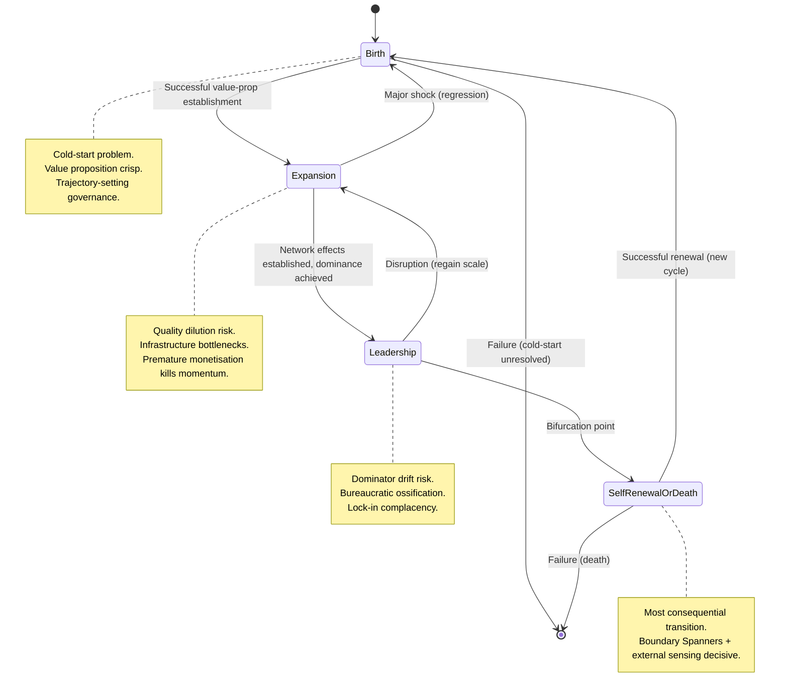

# Lifecycle State-Space Diagram

> **Mermaid source for the ecosystem lifecycle state space.** Reproducible per CR-WSF-17 Rev.1 §14.

## Source

## Modelling rules

1. States are **states** (specialisations of `wsf:State`), not a strictly linear path.
2. Transitions are **Events** that can be asserted with provenance.
3. Each state assertion MUST carry time validity.
4. Health, governance, and risk profiles differ per state — prescriptive analysis requires state context.
